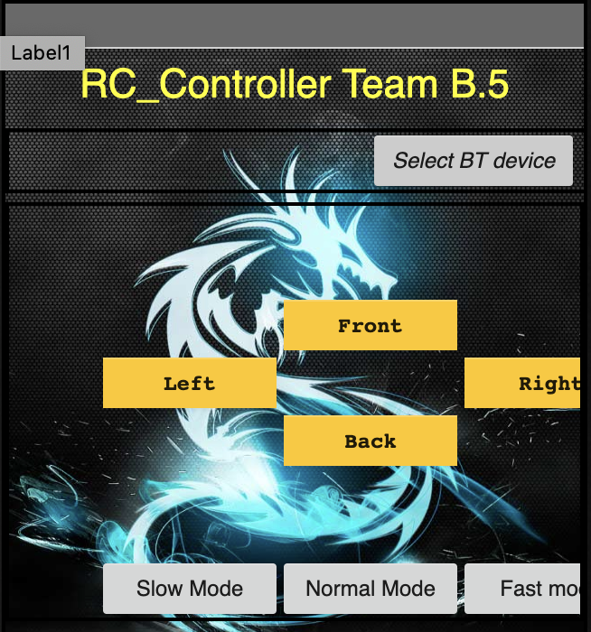

# EGEN310_CarModule
EGEN310_CarModule

Christian Marquardt developed the Arduino Code which is in the folder ControlModule
The app was used with MIT App Inventor with the idea of sending a string message that would eventually be decoded by the Arduino code.

Note: While it does look off-centered, it was done so that it would fit correctly on our Google Pixel 2 phone.
